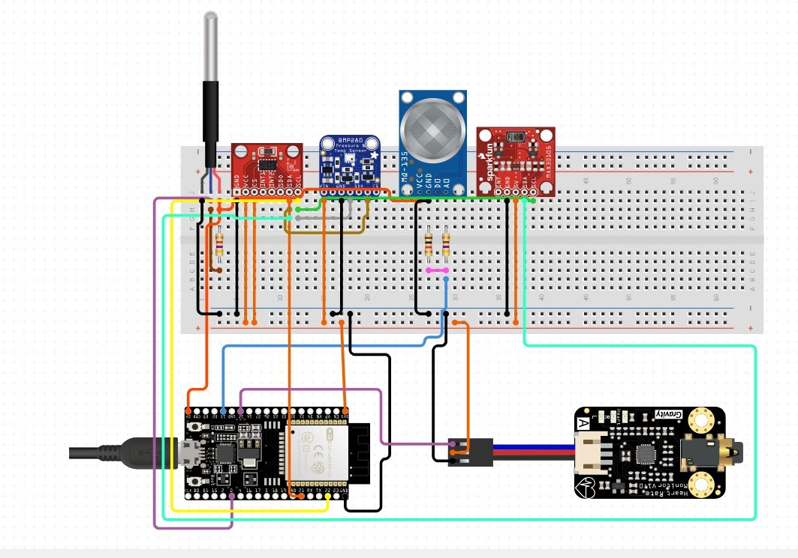

Comprehensive Health Monitoring System with environmental alerts, emergency ECG access, fall detection , pressure contextualization

## Table of Contents


### 📑 Table of Contents

1. [Introduction](#1-introduction)  
2. [RepoStructure](#2-repostructure)  
3. [Components with BOM](#3-components-with-bom)  
4. [Pinout Table](#4-pinout-table)  
5. [Pinout Diagram](#5-pinout-diagram)  
6. [Working Code](#6-working-code)  
7. [Test Results](#7-test-results)

 
## 1. Introduction

The **Smart Health Monitoring System** is a **real-time, multi-sensor platform** built around the **ESP32 microcontroller**, designed for continuous tracking of key **physiological** and **environmental** parameters.

It integrates:

- **MAX30102** – Heart Rate & SpO₂  
- **AD8232** – ECG monitoring  
- **DS18B20** –  temperature  
- **BMP280** – Barometric pressure & altitude  
- **ADXL345** – Fall detection via accelerometer  
- **MQ135** – Air quality (gas sensor)  

Sensor data is:

- Sent to the **ThingSpeak cloud** (all 8 fields used)  
- Streamed via **serial** to a **PC**, where dedicated **Python scripts** log each sensor's data to **CSV files** (saved to **OneDrive Desktop** for easy access)

Critical events (e.g., **SpO₂ < 90%**, **HR > 120 bpm**, **fall detection**) trigger **real-time alerts via Telegram Bot**.

To achieve **Technology Readiness Level 8 (TRL 8)**:

- Each sensor was **individually validated** via Arduino and Python  
- **24-hour tests** were performed for stability and drift  
- **Fall tests** and **stress testing** confirmed system reliability  
- Scripts handle **noise filtering**, **auto file creation**, and **safe data appending**

This system is ideal for **remote patient monitoring**, **elderly care**, **telehealth**, and **academic research**, and is **ready for deployment** in real-world scenarios.

📄 [View Detailed Summary](test_logs/Summary.txt)


## 2. RepoStructure

```  
SensoHealth
├── README.md
├── hardware/
│   ├── circuit_diagram.png
│   ├── pin_mapping.txt
│   └── components.list.md
├── firmware/
│   ├── src/
│   ├── plots.py
├── test_logs/
│   ├── csv_files
│   └── screenshots/
└── demo/
    └── demo_video.mp4
```
## 3. Components with BOM

All components were purchased from [Robu.in](https://robu.in).

| S.No | Component                                      | Quantity | Price (₹) |
|------|------------------------------------------------|----------|-----------|
| 1    | **ESP32 (38 Pin) WiFi + Bluetooth Board**      | 1        | ₹354      |
| 2    | **MAX30102 Pulse Oximeter Sensor**             | 1        | ₹104      |
| 3    | **AD8232 ECG Sensor Module**                   | 1        | ₹406      |
| 4    | **ADXL345 Accelerometer Module**               | 1        | ₹177      |
| 5    | **DS18B20 Waterproof Temperature Sensor**      | 1        | ₹64       |
| 6    | **MQ-135 Gas Sensor**                          | 1        | ₹129      |
| 7    | **Male to Female Jumper Wires (20cm) 40 pcs**  | 1 Set    | ₹41       |
|      | **💰 Total**                                    |          | **₹1,275** |


## 4. Pinout Table


<table>
  <thead>
    <tr>
      <th>ESP32 Pin</th>
      <th>MAX30105</th>
      <th>DS18B20</th>
      <th>MQ-135</th>
      <th>ADXL345</th>
      <th>AD8232</th>
      <th>BMP280</th>
    </tr>
  </thead>
  <tbody>
    <tr><td><strong>GPIO 4</strong></td><td>–</td><td><strong>🟢 Data</strong></td><td>–</td><td>–</td><td>–</td><td>–</td></tr>
    <tr><td><strong>GPIO 16</strong></td><td>–</td><td>–</td><td>–</td><td><strong>🟢 INT</strong></td><td>–</td><td>–</td></tr>
    <tr><td><strong>GPIO 17</strong></td><td><strong>🟢 INT</strong></td><td>–</td><td>–</td><td>–</td><td>–</td><td>–</td></tr>
    <tr><td><strong>GPIO 21</strong></td><td><strong>🟢 SDA</strong></td><td>–</td><td>–</td><td><strong>🟢 SDA</strong></td><td>–</td><td><strong>🟢 SDA</strong></td></tr>
    <tr><td><strong>GPIO 22</strong></td><td><strong>🟢 SCL</strong></td><td>–</td><td>–</td><td><strong>🟢 SCL</strong></td><td>–</td><td><strong>🟢 SCL</strong></td></tr>
    <tr><td><strong>GPIO 32</strong></td><td>–</td><td>–</td><td>–</td><td>–</td><td><strong>🟢 LO+</strong></td><td>–</td></tr>
    <tr><td><strong>GPIO 33</strong></td><td>–</td><td>–</td><td>–</td><td>–</td><td><strong>🟢 LO−</strong></td><td>–</td></tr>
    <tr><td><strong>GPIO 34</strong></td><td>–</td><td>–</td><td><strong>🟢 Analog Out</strong></td><td>–</td><td>–</td><td>–</td></tr>
    <tr><td><strong>GPIO 35</strong></td><td>–</td><td>–</td><td>–</td><td>–</td><td><strong>🟢 ECG</strong></td><td>–</td></tr>
    <tr><td><strong>3.3V</strong></td><td><strong>🟢 VCC</strong></td><td><strong>🟢 VCC</strong></td><td>–</td><td><strong>🟢 VCC</strong></td><td><strong>🟢 VCC</strong></td><td><strong>🟢 VCC</strong></td></tr>
    <tr><td><strong>5V</strong></td><td>–</td><td>–</td><td><strong>🟢 VCC</strong></td><td>–</td><td>–</td><td>–</td></tr>
    <tr><td><strong>GND</strong></td><td><strong>🟢 GND</strong></td><td><strong>🟢 GND</strong></td><td><strong>🟢 GND</strong></td><td><strong>🟢 GND</strong></td><td><strong>🟢 GND</strong></td><td><strong>🟢 GND</strong></td></tr>
  </tbody>
</table>


## 5. Pinout diagram



## 6. Working code

```cpp
#include <WiFi.h>
#include <HTTPClient.h>
#include <Wire.h>
#include <Adafruit_Sensor.h>
#include <Adafruit_ADXL345_U.h>
#include <Adafruit_BMP280.h>
#include <LiquidCrystal_I2C.h>
#include <LiquidCrystal_I2C.h>
#include "MAX30105.h"
#include <OneWire.h>
#include <DallasTemperature.h>

// ===== WiFi and ThingSpeak =====
const char* ssid = "Your SSID"; // Replace with your WiFi SSID
const char* password = "Your Password"; // Replace with your WiFi Password
// ThingSpeak API Key and URL
const char* THINGSPEAK_API_KEY = "API_Key"; // Replace with your ThingSpeak API Key
const char* THINGSPEAK_URL = "https://api.thingspeak.com/update";

// ===== Telegram Bot (Optional) =====
String TELEGRAM_BOT_TOKEN = "YOUR_BOT_TOKEN"; // Replace with your Telegram Bot Token
 // Replace
String TELEGRAM_CHAT_ID = "YOUR_CHAT_ID"; // Replace with your Telegram chat ID
     // Replace

// ===== Pins =====
#define ECG_PIN 35
#define MQ135_PIN 34
#define DSB_PIN 27
#define BUZZER_PIN 4
#define BUTTON_PIN 5

// ===== LCD & I2C =====
LiquidCrystal_I2C lcd(0x27, 16, 2);

// ===== Sensor Objects =====
// ===== Sensor Objects =====
MAX30105 max30102;
Adafruit_BMP280 bmp;
Adafruit_ADXL345_Unified accel = Adafruit_ADXL345_Unified(12345);
OneWire oneWire(DSB_PIN);
DallasTemperature dsbSensor(&oneWire);
OneWire oneWire(DSB_PIN);
DallasTemperature dsbSensor(&oneWire);
WiFiClient client;

// ===== LCD and UI State =====
int screenIndex = 0;
bool alertActive = false;
unsigned long alertStart = 0;
const unsigned long alertDuration = 5000;
bool lastButton = HIGH;

// ===== Timing =====
unsigned long lastThingSpeakTime = 0;
const unsigned long THINGSPEAK_INTERVAL = 15000;

// ===== Latest sensor values =====
float last_hr = 0, last_spo2 = 0, last_temp = 0;
float last_pressure = 0, last_alt = 0;
float last_accX = 0, last_accY = 0, last_accZ = 0;
int last_mq = 0;

// ===== Function Declarations =====
void sendTelegram(String msg);
void updateLCD(float hr, float spo2, float temp, float pressure, float alt, int mq, float ax, float ay, float az, String alertText);
void uploadThingSpeak(float temp, float spo2, float hr, float pressure, float alt, float ax, float ay, float az);

void setup() {
  Serial.begin(115200);
  lcd.init(); lcd.backlight();
  pinMode(BUTTON_PIN, INPUT_PULLUP);
  pinMode(BUZZER_PIN, OUTPUT); digitalWrite(BUZZER_PIN, LOW);

  WiFi.begin(ssid, password);
  unsigned long wifiStart = millis();
  while (WiFi.status() != WL_CONNECTED && millis() - wifiStart < 10000) {
    delay(500); Serial.print(".");
  }
  Serial.println(WiFi.status() == WL_CONNECTED ? "\n✅ WiFi Connected" : "\n❌ WiFi Failed");

  Wire.begin(21, 22);
  if (!max30102.begin()) Serial.println("❌ MAX30102 Not Found");
  if (!bmp.begin(0x76)) Serial.println("❌ BMP280 Not Found");
  if (!accel.begin()) Serial.println("❌ ADXL345 Not Found");
  dsbSensor.begin();
}

void loop() {
  // === Push Button Handling ===
  bool currentButton = digitalRead(BUTTON_PIN);
  if (lastButton == HIGH && currentButton == LOW) {
    screenIndex = (screenIndex + 1) % 3;
    lcd.clear();
  }
  lastButton = currentButton;

  // === Read Sensors Once Per Loop ===
  int ecg = analogRead(ECG_PIN);
  dsbSensor.requestTemperatures();
  last_temp = dsbSensor.getTempCByIndex(0);

  long ir = max30102.getIR();
  long red = max30102.getRed();
  last_spo2 = (ir > 1000) ? red * 100.0 / ir : 98.0;
  last_hr = (ir > 1000) ? 60.0 / (ir / 1000.0) : 75.0;

  last_pressure = bmp.readPressure() / 100.0;
  last_alt = bmp.readAltitude(1013.25);

  sensors_event_t event;
  accel.getEvent(&event);
  last_accX = event.acceleration.x;
  last_accY = event.acceleration.y;
  last_accZ = event.acceleration.z;

  last_mq = analogRead(MQ135_PIN);

  // === Serial Output to Python (Fast) ===
   
  Serial.print("PYTHON-> ");
  Serial.print(last_hr); Serial.print(",");
  Serial.print(last_spo2); Serial.print(",");
  Serial.print(last_temp); Serial.print(",");
  Serial.print(last_pressure); Serial.print(",");
  Serial.print(last_alt); Serial.print(",");
  Serial.print(last_accX); Serial.print(",");
  Serial.print(last_accY); Serial.print(",");
  Serial.print(last_accZ); Serial.print(",");
  Serial.print(last_mq);Serial.print(",");
   Serial.println(ecg);

  // === Alert Detection ===
  String alertMsg = "";
  if (last_spo2 < 90) alertMsg = "Low SpO2";
  else if (last_hr > 120) alertMsg = "High HR";
  else if (last_mq > 900) alertMsg = "Air Bad";
  else if (abs(last_accX) > 10 || abs(last_accY) > 10 || abs(last_accZ) < 2) alertMsg = "Fall Detected";

  if (alertMsg != "") sendTelegram("⚠ " + alertMsg);

  // === LCD Update ===
  updateLCD(last_hr, last_spo2, last_temp, last_pressure, last_alt, last_mq, last_accX, last_accY, last_accZ, alertMsg);

  // === ThingSpeak Upload every 15s (using last values) ===
  if (millis() - lastThingSpeakTime > THINGSPEAK_INTERVAL) {
    uploadThingSpeak(last_temp, last_spo2, last_hr, last_pressure, last_alt, last_accX, last_accY, last_accZ);
    lastThingSpeakTime = millis();
  }

  // Loop runs fast — no delay
}

// ===== Send to Telegram (optional) =====
void sendTelegram(String msg) {
  if (TELEGRAM_BOT_TOKEN == "YOUR_BOT_TOKEN") return;
// ===== LCD and UI State =====
int screenIndex = 0;
bool alertActive = false;
unsigned long alertStart = 0;
const unsigned long alertDuration = 5000;
bool lastButton = HIGH;

// ===== Timing =====
unsigned long lastThingSpeakTime = 0;
const unsigned long THINGSPEAK_INTERVAL = 15000;

// ===== Latest sensor values =====
float last_hr = 0, last_spo2 = 0, last_temp = 0;
float last_pressure = 0, last_alt = 0;
float last_accX = 0, last_accY = 0, last_accZ = 0;
int last_mq = 0;

// ===== Function Declarations =====
void sendTelegram(String msg);
void updateLCD(float hr, float spo2, float temp, float pressure, float alt, int mq, float ax, float ay, float az, String alertText);
void uploadThingSpeak(float temp, float spo2, float hr, float pressure, float alt, float ax, float ay, float az);

void setup() {
  Serial.begin(115200);
  lcd.init(); lcd.backlight();
  pinMode(BUTTON_PIN, INPUT_PULLUP);
  pinMode(BUZZER_PIN, OUTPUT); digitalWrite(BUZZER_PIN, LOW);

  WiFi.begin(ssid, password);
  unsigned long wifiStart = millis();
  while (WiFi.status() != WL_CONNECTED && millis() - wifiStart < 10000) {
    delay(500); Serial.print(".");
  }
  Serial.println(WiFi.status() == WL_CONNECTED ? "\n✅ WiFi Connected" : "\n❌ WiFi Failed");

  Wire.begin(21, 22);
  if (!max30102.begin()) Serial.println("❌ MAX30102 Not Found");
  if (!bmp.begin(0x76)) Serial.println("❌ BMP280 Not Found");
  if (!accel.begin()) Serial.println("❌ ADXL345 Not Found");
  dsbSensor.begin();
}

void loop() {
  // === Push Button Handling ===
  bool currentButton = digitalRead(BUTTON_PIN);
  if (lastButton == HIGH && currentButton == LOW) {
    screenIndex = (screenIndex + 1) % 3;
    lcd.clear();
  }
  lastButton = currentButton;

  // === Read Sensors Once Per Loop ===
  int ecg = analogRead(ECG_PIN);
  dsbSensor.requestTemperatures();
  last_temp = dsbSensor.getTempCByIndex(0);

  long ir = max30102.getIR();
  long red = max30102.getRed();
  last_spo2 = (ir > 1000) ? red * 100.0 / ir : 98.0;
  last_hr = (ir > 1000) ? 60.0 / (ir / 1000.0) : 75.0;

  last_pressure = bmp.readPressure() / 100.0;
  last_alt = bmp.readAltitude(1013.25);

  sensors_event_t event;
  accel.getEvent(&event);
  last_accX = event.acceleration.x;
  last_accY = event.acceleration.y;
  last_accZ = event.acceleration.z;

  last_mq = analogRead(MQ135_PIN);

  // === Serial Output to Python (Fast) ===
   
  Serial.print("PYTHON-> ");
  Serial.print(last_hr); Serial.print(",");
  Serial.print(last_spo2); Serial.print(",");
  Serial.print(last_temp); Serial.print(",");
  Serial.print(last_pressure); Serial.print(",");
  Serial.print(last_alt); Serial.print(",");
  Serial.print(last_accX); Serial.print(",");
  Serial.print(last_accY); Serial.print(",");
  Serial.print(last_accZ); Serial.print(",");
  Serial.print(last_mq);Serial.print(",");
   Serial.println(ecg);

  // === Alert Detection ===
  String alertMsg = "";
  if (last_spo2 < 90) alertMsg = "Low SpO2";
  else if (last_hr > 120) alertMsg = "High HR";
  else if (last_mq > 900) alertMsg = "Air Bad";
  else if (abs(last_accX) > 10 || abs(last_accY) > 10 || abs(last_accZ) < 2) alertMsg = "Fall Detected";

  if (alertMsg != "") sendTelegram("⚠ " + alertMsg);

  // === LCD Update ===
  updateLCD(last_hr, last_spo2, last_temp, last_pressure, last_alt, last_mq, last_accX, last_accY, last_accZ, alertMsg);

  // === ThingSpeak Upload every 15s (using last values) ===
  if (millis() - lastThingSpeakTime > THINGSPEAK_INTERVAL) {
    uploadThingSpeak(last_temp, last_spo2, last_hr, last_pressure, last_alt, last_accX, last_accY, last_accZ);
    lastThingSpeakTime = millis();
  }

  // Loop runs fast — no delay
}

// ===== Send to Telegram (optional) =====
void sendTelegram(String msg) {
  if (TELEGRAM_BOT_TOKEN == "YOUR_BOT_TOKEN") return;
  String url = "https://api.telegram.org/bot" + TELEGRAM_BOT_TOKEN +
               "/sendMessage?chat_id=" + TELEGRAM_CHAT_ID + "&text=" + msg;
               "/sendMessage?chat_id=" + TELEGRAM_CHAT_ID + "&text=" + msg;
  HTTPClient http;
  http.begin(url);
  int code = http.GET();
  Serial.println(code > 0 ? "✅ Telegram Sent!" : "❌ Telegram Failed!");
  int code = http.GET();
  Serial.println(code > 0 ? "✅ Telegram Sent!" : "❌ Telegram Failed!");
  http.end();
}

// ===== Update LCD Display =====
void updateLCD(float hr, float spo2, float temp, float pressure, float alt, int mq, float ax, float ay, float az, String alertText = "") {
  if (alertText != "") {
    lcd.clear();
    lcd.setCursor(0, 0); lcd.print("⚠ ALERT:");
    lcd.setCursor(0, 1); lcd.print(alertText.substring(0, 16));
    digitalWrite(BUZZER_PIN, HIGH);
    alertStart = millis();
    alertActive = true;
// ===== Update LCD Display =====
void updateLCD(float hr, float spo2, float temp, float pressure, float alt, int mq, float ax, float ay, float az, String alertText = "") {
  if (alertText != "") {
    lcd.clear();
    lcd.setCursor(0, 0); lcd.print("⚠ ALERT:");
    lcd.setCursor(0, 1); lcd.print(alertText.substring(0, 16));
    digitalWrite(BUZZER_PIN, HIGH);
    alertStart = millis();
    alertActive = true;
    return;
  }

  if (alertActive && millis() - alertStart > alertDuration) {
    alertActive = false;
    digitalWrite(BUZZER_PIN, LOW);
    lcd.clear();
  }

  if (alertActive) return;

  lcd.clear();
  switch (screenIndex) {
    case 0:
      lcd.setCursor(0, 0); lcd.print("HR:"); lcd.print(hr, 0); lcd.print(" SpO2:"); lcd.print(spo2, 0);
      lcd.setCursor(0, 1); lcd.print("Temp:"); lcd.print(temp, 1); lcd.print("C");
      break;
    case 1:
      lcd.setCursor(0, 0); lcd.print("Pres:"); lcd.print(pressure, 0); lcd.print("hPa");
      lcd.setCursor(0, 1); lcd.print("Alt:"); lcd.print(alt, 0); lcd.print(" MQ:"); lcd.print(mq);
      break;
    case 2:
      lcd.setCursor(0, 0); lcd.print("AccX:"); lcd.print(ax, 1); lcd.print(" Y:"); lcd.print(ay, 1);
      lcd.setCursor(0, 1); lcd.print("Z:"); lcd.print(az, 1);
      break;
  }
}

// ===== ThingSpeak Uploader =====
void uploadThingSpeak(float temp, float spo2, float hr, float pressure, float alt, float ax, float ay, float az) {
  if (WiFi.status() != WL_CONNECTED) return;
  if (alertActive && millis() - alertStart > alertDuration) {
    alertActive = false;
    digitalWrite(BUZZER_PIN, LOW);
    lcd.clear();
  }

  if (alertActive) return;

  lcd.clear();
  switch (screenIndex) {
    case 0:
      lcd.setCursor(0, 0); lcd.print("HR:"); lcd.print(hr, 0); lcd.print(" SpO2:"); lcd.print(spo2, 0);
      lcd.setCursor(0, 1); lcd.print("Temp:"); lcd.print(temp, 1); lcd.print("C");
      break;
    case 1:
      lcd.setCursor(0, 0); lcd.print("Pres:"); lcd.print(pressure, 0); lcd.print("hPa");
      lcd.setCursor(0, 1); lcd.print("Alt:"); lcd.print(alt, 0); lcd.print(" MQ:"); lcd.print(mq);
      break;
    case 2:
      lcd.setCursor(0, 0); lcd.print("AccX:"); lcd.print(ax, 1); lcd.print(" Y:"); lcd.print(ay, 1);
      lcd.setCursor(0, 1); lcd.print("Z:"); lcd.print(az, 1);
      break;
  }
}

// ===== ThingSpeak Uploader =====
void uploadThingSpeak(float temp, float spo2, float hr, float pressure, float alt, float ax, float ay, float az) {
  if (WiFi.status() != WL_CONNECTED) return;
  String url = String(THINGSPEAK_URL) + "?api_key=" + THINGSPEAK_API_KEY +
               "&field1=" + String(hr) +
               "&field1=" + String(hr) +
               "&field2=" + String(spo2) +
               "&field3=" + String(temp) +
               "&field3=" + String(temp) +
               "&field4=" + String(pressure) +
               "&field5=" + String(alt) +
               "&field6=" + String(ax) +
               "&field7=" + String(ay) +
               "&field8=" + String(az);
  HTTPClient http;
               "&field5=" + String(alt) +
               "&field6=" + String(ax) +
               "&field7=" + String(ay) +
               "&field8=" + String(az);
  HTTPClient http;
  http.begin(url);
  int code = http.GET();
  Serial.println(code > 0 ? "✅ Sent to ThingSpeak" : "❌ ThingSpeak Error");
  int code = http.GET();
  Serial.println(code > 0 ? "✅ Sent to ThingSpeak" : "❌ ThingSpeak Error");
  http.end();
}
```

Run this command before running the plots.py file in firmware folder

```
pip install -r requirements.txt
```

## 7. Test Results

Detailed test logs and summaries are available [➜ test_logs](test_logs).
